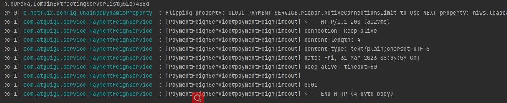

## Feign
Feign是一个声明式的Web服务客户端,让编写Web服务客户端变得非常容易,只需创建一个接口并在接口上添加注解即可

### 服务调用
#### 配置步骤
- 1、创建feign客户端（service接口），并添加类注解.例如：@FeignClient("CLOUD-PAYMENT-SERVICE")
- 2、添加方法，即调用其他接口，类似于controller的方法调用
- 3、创建controller，对应创建访问service方法的地址
- 4、主启动类添加注解@EnableFeignClients ，用于扫描发现Feign客户端


### 超时控制
yml配置
```
#设置feign客户端超时时间(OpenFeign默认支持ribbon)
ribbon:
  #指的是建立连接所用的时间,适用于网络状态正常的情况下,两端连接所用的时间
  ReadTimeout: 5000
  #指的是建立连接后从服务器读取到可用资源所用的时间
  ConnectTimeout: 5000
```


### 日志
Feign提供了日志打印功能，可以通过配置来调整日志级别，从而了解Feign中Http请求的细节。
说白了就是对Feign接口的调用情况进行监控和输出

#### 日志级别
```
NONE:默认的，不显示任何日志
BASIC:仅记录请求方法、URL、响应状态码及执行时间;
HEADERS:除了BASIC中定义的信息之外，还有请求和响应的头信息;
FULL:除了HEADERS中定义的信息之外，还有请求和响应的正文及元数据。
```

#### 后台查看日志



